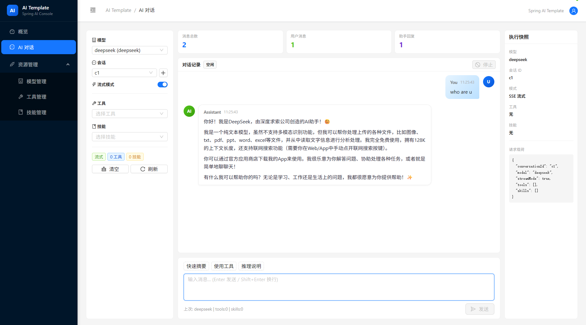
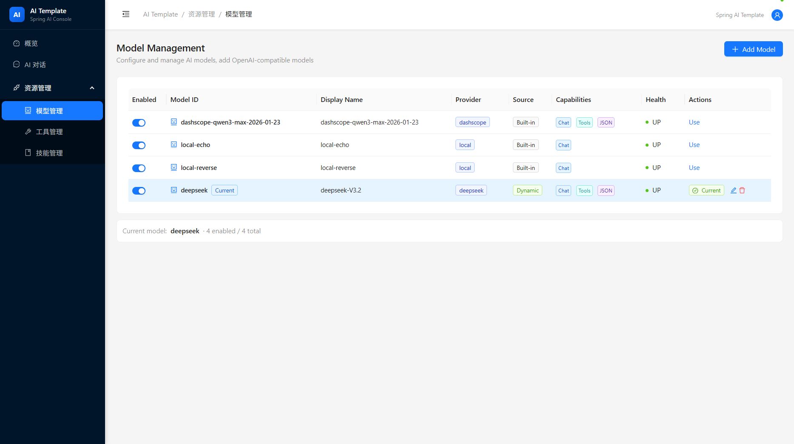
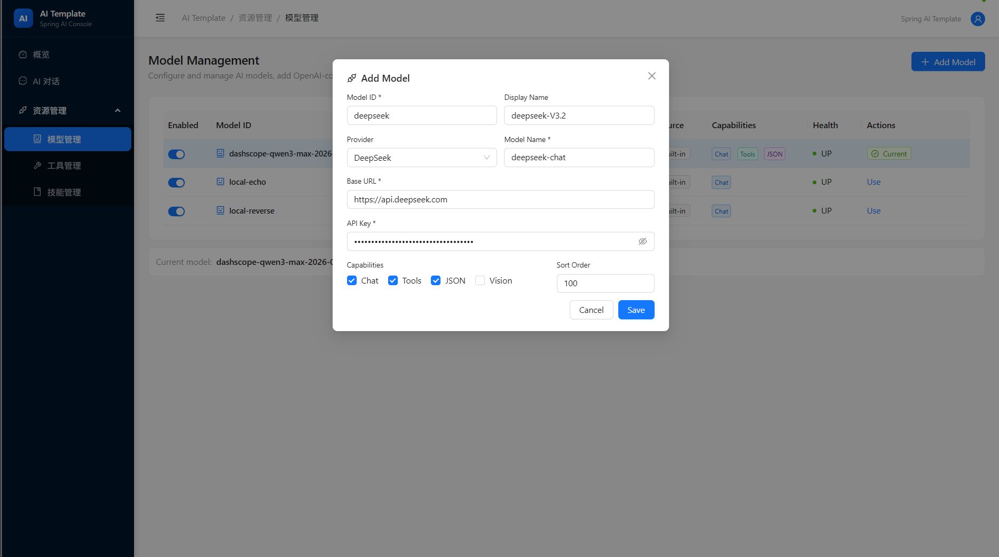
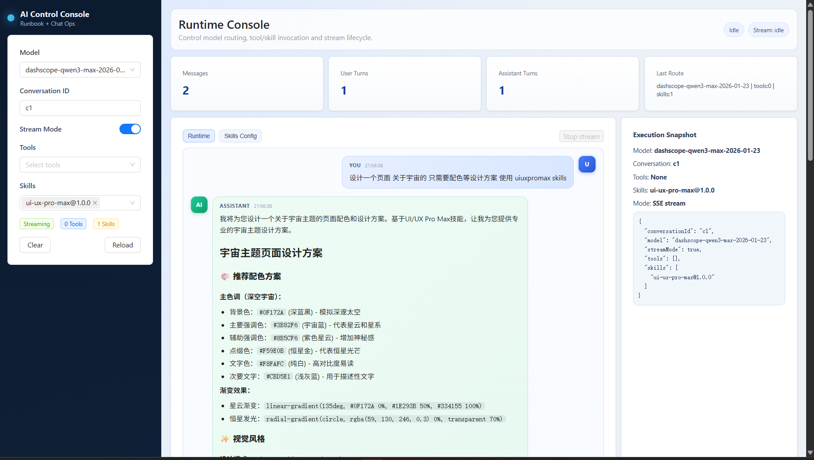
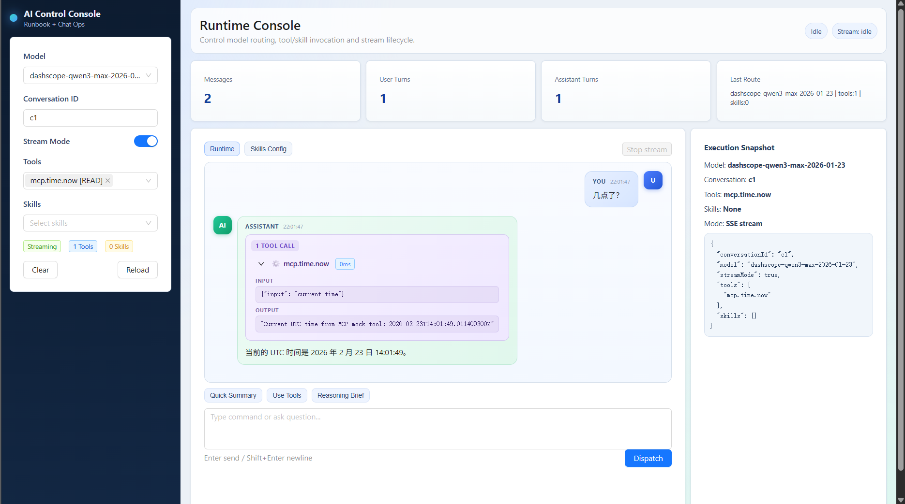

<h1 align="center">Spring AI Template</h1>

<p align="center">
  <b>开箱即用的企业级 AI 应用模板 — 30 分钟从零到生产</b>
</p>

<p align="center">
  
  
  
  
  
</p>

<p align="center">
  <b>
    觉得有用？请给个 Star 支持一下！
  </b>
</p>

---

## Why This Template?

> 不是 Demo，是**真正能二开的模板**。

| 痛点 | 本模板的解法 |
|---|---|
| 接入新模型要改一堆核心代码 | **SPI 插件架构** — 新增模型/工具/技能只加文件，不改 core |
| 聊天记录重启就没了 | **JDBC 持久化记忆** — 默认 H2 零配置，一行改 MySQL |
| 从零搭项目要几天 | **克隆即跑** — 30 分钟跑通模型+工具+流式输出 |
| Function Calling 接入复杂 | **内置工具链** — SAA Agent + Skills + MCP 开箱可用 |

---

## Features

- **多模型路由** — OpenAI / DashScope / DeepSeek / Ollama，按需切换，统一接口
- **模型管理后台** — 管理员动态添加、编辑、删除、启用/禁用模型，支持任意 OpenAI 兼容 API
- **聊天记忆** — JDBC 持久化，H2 零配置启动，配置切 MySQL/PostgreSQL
- **Function Calling** — SAA ReactAgent 驱动，工具自动注入，支持 Tracing
- **Skills 系统** — 命名空间 + 版本管理 + Python 脚本执行 + `skills.sh` 批量导入
- **MCP 能力** — 按开关启用外部 MCP 工具（搜索、文件、数据库）
- **流式输出** — SSE 实时推送 token + 工具调用元数据
- **React 控制台** — Ant Design 5 + Zustand，模型/工具/技能/对话全可控
- **插件化扩展** — `ModelAdapter` / `ToolAdapter` / `SkillProvider` 三大 SPI

---

## Screenshots

### AI 对话

多模型切换、流式输出（SSE）、工具调用追踪、会话历史管理。



### 模型管理

管理员后台配置和管理 AI 模型，支持内置模型启用/禁用，动态添加 OpenAI 兼容模型。



### 添加模型

通过管理界面动态添加新模型，配置 API 地址、密钥、模型名称和能力声明，无需修改代码。



### Skills 技能 & MCP 工具

Skills 技能系统按需加载增强模型能力；MCP 协议接入外部工具，实时展示执行过程。

<p>
  
  
</p>

---

## Quick Start

### 1. 启动后端

```bash
cd backend

# 最小启动（仅需 DashScope 密钥）
export DASHSCOPE_API_KEY="your_key"
mvn spring-boot:run -Dspring-boot.run.profiles=local-minimal

# 完整启动（OpenAI + DashScope + MCP）
export OPENAI_API_KEY="your_key"
export DASHSCOPE_API_KEY="your_key"
mvn spring-boot:run -Dspring-boot.run.profiles=local-full
```

### 2. 启动前端

```bash
cd frontend
npm install
npm run dev
```

### 3. 打开浏览器

访问 **http://localhost:5173**，选择模型即可对话。

---

## Chat Memory — 聊天记忆

本模板内置 **JDBC 持久化聊天记忆**，基于 Spring AI `ChatMemory` + `JdbcChatMemoryRepository`。

### 默认：H2 内存数据库（零配置）

启动即用，无需任何额外配置。聊天记录自动持久化，支持对话历史回溯。

### 切换 MySQL

```bash
mvn spring-boot:run -Dspring-boot.run.profiles=local-minimal,mysql
```

设置环境变量：

```bash
export DB_USERNAME="root"
export DB_PASSWORD="your_password"
```

MySQL 配置文件 `application-mysql.yml`：

```yaml
spring:
  datasource:
    url: jdbc:mysql://localhost:3306/ai_template?useSSL=false&serverTimezone=UTC
    username: ${DB_USERNAME:root}
    password: ${DB_PASSWORD:}
    driver-class-name: com.mysql.cj.jdbc.Driver
```

### 调整记忆窗口

```yaml
app:
  chat:
    memory:
      max-messages: 20    # 每个对话保留最近 N 条消息
```

### 对话管理 API

| 接口 | 说明 |
|---|---|
| `GET /api/conversations` | 列出所有对话 |
| `GET /api/conversations/{id}/messages` | 获取对话历史消息 |
| `DELETE /api/conversations/{id}` | 清除对话记录 |

---

## Architecture

```
Frontend (React 19 + Ant Design + Zustand)
  ├─ ModelSelector / ToolsPanel / SkillsPanel / ChatWindow
  └─ SSE Client (streaming + tool_call events)
            |
            v
Backend (Spring Boot 3.5 + Spring AI 1.1)
  ├─ ChatController (/api/chat, /api/chat/stream)
  ├─ ConversationController (/api/conversations)
  ├─ ModelAdminController (/api/admin/models) — CRUD + toggle
  ├─ SkillAdminController (/api/admin/skills) — CRUD + import
  ├─ ChatService (ReactAgent + ChatMemory integration)
  ├─ ModelRegistry → builtin adapters + dynamic adapters + enable/disable
  ├─ ToolRegistry  → ToolAdapter SPI
  ├─ SkillRegistry → builtin + dynamic skills
  └─ ChatMemory → JdbcChatMemoryRepository → H2 / MySQL
            |
            v
Providers: DashScope / OpenAI / DeepSeek / Ollama / Any OpenAI-compatible
MCP Servers: brave-search / filesystem (optional)
```

### 插件化 SPI

```java
// 新增模型 — 实现 ModelAdapter 即可
public interface ModelAdapter {
    String provider();
    String modelId();
    CapabilitySet capabilities();
    HealthStatus health();
    ChatResult invoke(ChatCommand cmd);
    Flux<String> stream(ChatCommand cmd);
}

// 新增工具 — 实现 ToolAdapter 即可
public interface ToolAdapter {
    String toolName();
    ToolRiskLevel riskLevel();
    ToolResult invoke(ToolCommand cmd);
}

// 新增技能 — 实现 SkillProvider 即可
public interface SkillProvider {
    String skillName();
    String version();
    String content();
}
```

> **扩展原则：新增能力只加 `plugins/` 下的文件，永远不改 `core/`。**

---

## Project Structure

```
backend/
  core/          # SPI 接口定义（ModelAdapter / ToolAdapter / SkillProvider）
  app/           # 服务编排（ChatService / ModelRegistry / ToolRegistry / SkillRegistry）
  plugins/       # 插件实现（model/ tool/ skill/）
  api/           # REST 接口 + DTO + Admin Controller
  infra/         # 基础设施（安全、HTTP、记忆配置）

frontend/
  src/pages/     # 页面（Dashboard / Chat / Models / Tools / Skills）
  src/layouts/   # 布局（MainLayout — 暗色侧边栏 + 面包屑）
  src/core/      # API client + Zustand state
  src/shared/    # 共享组件（MessageBubble / ToolCallCard）
  src/utils/     # 工具函数（SSE streaming / format）

docs/
  photos/        # 截图
  quickstart/    # 快速启动文档
  extension-guides/  # 扩展指南
  troubleshooting/   # 故障排查
```

---

## API Key Configuration

| 环境变量 | 用途 | 必填 |
|---|---|---|
| `DASHSCOPE_API_KEY` | DashScope / 通义千问 | local-minimal 必填 |
| `OPENAI_API_KEY` | OpenAI 兼容接口 | local-full 必填 |
| `DB_USERNAME` | MySQL 用户名 | mysql profile 必填 |
| `DB_PASSWORD` | MySQL 密码 | mysql profile 必填 |

<details>
<summary><b>Windows PowerShell 配置</b></summary>

```powershell
# 当前终端临时生效
$env:DASHSCOPE_API_KEY="your_key"
$env:OPENAI_API_KEY="your_key"

# 写入用户环境变量（长期生效）
[Environment]::SetEnvironmentVariable("DASHSCOPE_API_KEY","your_key","User")
```

</details>

---

## Function Calling & Skills

### 验证 Function Calling

1. 使用 `local-full` 启动后端
2. 前端选择真实模型（如 `dashscope-qwen3.5-plus`）
3. 勾选工具：`weather.query` 或 `mcp.time.now`
4. 提问：`帮我查一下北京天气并总结`

### Skills 管理

- 前端 **Skills Config** 面板支持新增/删除/导入
- 支持 `skills.sh` 批量导入格式
- 支持 URL/GitHub slug 远程导入
- Python 脚本技能自动发现执行

<details>
<summary><b>skills.sh 示例</b></summary>

```bash
add_skill "team/custom/research" "1.0.0" <<'EOF'
You are a research copilot.
Always provide 3 key findings first.
EOF
```

</details>

---

## Tech Stack

| Layer | Technology |
|---|---|
| Backend | Spring Boot 3.5.9, Spring AI 1.1.2, Spring AI Alibaba 1.1.2.0 |
| Frontend | React 19, Vite 7, Ant Design 5, Zustand |
| Database | H2 (default) / MySQL / PostgreSQL |
| AI Models | OpenAI, DashScope, Local Mock |
| Agent | SAA ReactAgent + SkillsAgentHook |

---

## Roadmap

- [x] Phase 1 — 模型路由 + 工具调用 + 流式输出 + Web 控制台
- [x] Phase 1.5 — JDBC 聊天记忆 + 对话管理 API
- [x] Phase 2 — 模型管理后台 + Skills 管理 + 动态模型配置
- [ ] Phase 3 — MCP 插件生态 + 插件脚手架
- [ ] Phase 4 — 鉴权 + 限流 + 审计 + 可观测 + 成本治理

---

## Contributing

欢迎提交 Issue 和 PR！

1. Fork 本仓库
2. 创建特性分支：`git checkout -b feature/your-feature`
3. 提交变更：`git commit -m 'Add your feature'`
4. 推送分支：`git push origin feature/your-feature`
5. 提交 Pull Request

---

<p align="center">
  <b>如果这个模板帮到了你，请点个 Star 让更多人看到！</b>
</p>
